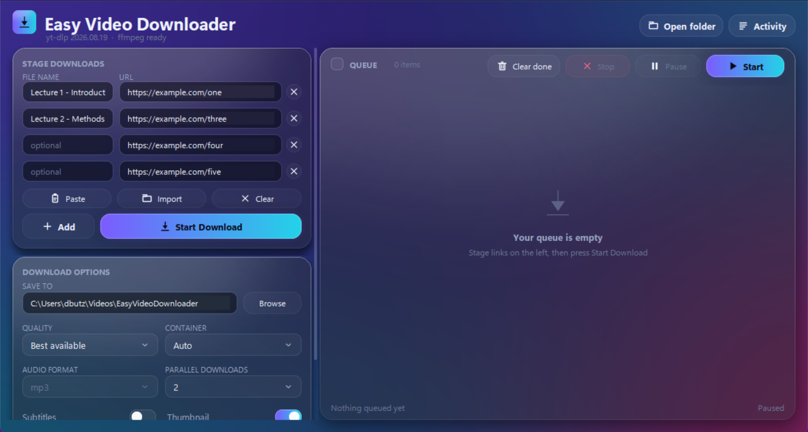

<p align="center">
  
</p>

# Easy-dlp

A dark, liquid-glass desktop front end for the `yt-dlp` command line, with a
batch download queue.



## Run it

Double-click **`dist\Easy-dlp.exe`**. That is a single packaged
file with Python, tkinter and Pillow inside it, so nothing needs installing and
you can move it wherever you like (Desktop, Start menu, pinned to the taskbar).

It still calls the real `yt-dlp` and `ffmpeg` on your PATH, which is what keeps
the download engine current — update yt-dlp whenever a site changes and the app
picks it up. If yt-dlp is missing the app opens and says so rather than failing
silently.

To run from source instead:

```bash
python app.py
```

To rebuild the executable after changing the code:

```bash
python build_exe.py
```

### Requirements

| Needs | Why | Install |
| --- | --- | --- |
| `yt-dlp` on PATH | does the downloading | `winget install yt-dlp.yt-dlp` |
| `ffmpeg` on PATH | merging, audio extraction, embedding | `winget install yt-dlp.FFmpeg` |
| Python 3.10+ with tkinter | only to run from source or rebuild | ships with python.org installers |
| Pillow | only to run from source | `pip install -r requirements.txt` |
| PyInstaller | only to rebuild the .exe | `pip install pyinstaller` |

The app finds `yt-dlp` on PATH; running from source it also falls back to
`python -m yt_dlp`. If neither is there it still opens, warns you, and every job
fails with a clear message. The header shows the detected `yt-dlp` version and
whether ffmpeg was found.

`Easy-dlp.bat` is a convenience launcher for the source version
(starts it without a console window).

## Staging and downloading

The left column is a staging list, so everything happens in this one window
instead of keeping a browser, a text file and a downloader open side by side.

1. Each staged row is a pair of boxes: **FILE NAME** on the left, **URL** on the
   right. The name is optional.
2. **Add** appends another empty pair. It does not download anything, so you can
   build the whole list first. Pressing Enter in a URL box does the same.
3. The **x** at the end of a row removes that row. Hold **Shift** while clicking
   it to remove every row in the same numbered section, which clears out an
   opening section of twenty odd intro lessons in one click.
4. **Paste** fills empty rows from the clipboard, one row per link, adding rows
   as needed; **Import** does the same from a `.txt` file; **Clear** empties the
   list.
5. Paste a whole **course page** instead and it stages the entire course at
   once — see below.
6. **Start Download**, at the foot of the options below, queues every row that
   has a URL and starts working through them. The staging list then resets,
   ready for the next batch. It sits last on purpose: everything that decides
   where a download goes — the folder above all — is read on the way down to
   it, rather than being scrolled past after the fact.

### Staging a whole course from its page

Fishing each link out of the network tab is the slow part, so the app will read
a course page instead:

1. Open the course page in the browser, where every lesson is listed.
2. `Ctrl+U` to view the source, then `Ctrl+A`, `Ctrl+C`.
3. `Ctrl+V` in the app, or press **Paste**.

Every lesson is staged, named `Section.Lesson_Title` — `1.18_CreateABlurredBackground`
— so they land in the folder in course order without renaming anything. Saving
the page with `Ctrl+S` and using **Import** works too.

This reads the video id out of each lesson's own thumbnail, which is how Bunny
Stream (`b-cdn.net`) publishes it; it is not a general scraper. On a site that
hosts video another way nothing is found and the paste falls back to being read
as a plain list of links — see **Which players work how** below.

### Course resources

A course is rarely only its videos. Worksheets, brush sets, project files and
reference sheets come with it, and those are staged too: when a page offers a
handout, it is added after the lessons and downloaded as the file it is.

The rule is deliberately narrow, so a paste does not drag in every image on
the page. A link ending `.pdf`, `.zip`, `.psd`, `.brushset` and the like is a
handout by any reading, and comes along. A link ending `.png` or `.jpg` is as
likely to be the site's logo or somebody's avatar, so an image is only taken
when the page says outright that it is meant to be saved — a `download`
attribute, or wording that says so.

The two collector scripts do the same while they walk a course, and there they
can do better: a handout keeps the number of the lesson it belongs to, so
`2.05_ColourTheory_Worksheet.pdf` sorts beside `2.05_ColourTheory.mp4`.
Anything the course page itself offers, rather than one lesson, is numbered
`00_`.

Turn it off with the **Resources** switch under Download options if you only
want the videos.

Rows without a URL are ignored, and anything that is not an http(s) link is
skipped with a note rather than queued.

The staging list is saved as you build it, so closing the app — or losing it —
does not cost you the batch: it is still there the next time you open the
window. It is only cleared once you press Start Download.

**Parallel downloads** (1–6) decides how many run at once. Set it to 1 and the
queue works strictly one at a time; at 2 or more, that many run together and the
rest wait their turn.

Each queue row shows live percentage, speed, ETA and transferred size, and while
a playlist is running it shows `4/13` for the item it is on.

Options are captured per job when you press Start Download, so changing them
afterwards affects only what you stage next.

## Which players work how

Course sites hand their video to one of a handful of players, and which one
decides how much work a batch takes. What follows was tested against a real
course on each.

| Player | Tell-tale in the address | What you paste | Sign-in | Whole course at once |
|---|---|---|---|---|
| Bunny Stream | `b-cdn.net` | the course page source | no | **yes** — paste the page |
| Cloudflare Stream | `cloudflarestream.com` | signed links, ~6 hours | carried in the link | **yes** — console tool |
| Wistia | `wistia` in the page | the lesson page address | **cookies.txt** | partly — links are listed |
| Vimeo | `player.vimeo.com/video/…` | that address | usually none | no — one at a time |

### Bunny Stream — paste the page

The video id alone plays, with nothing to authorise it, so the whole course
comes out of one page. See **Staging a whole course from its page** above.
Tested on a 53 lesson course: all 53, correctly numbered.

### Cloudflare Stream — run the collector

The video id on its own is refused with a 401 here. Playback is authorised by a
signed token that lasts about **six hours** and is never in the page source, so
pasting the page achieves nothing — the links have to be caught as each lesson
plays.

1. Open the course, signed in.
2. **Press play on the first lesson** and let it start. Browsers block playback
   until you have interacted with the page, and with no playback there is no
   link to catch.
3. `F12` → Console → paste the whole of `tools/cloudflare-stream-links.js` →
   Enter.
4. Wait, roughly ten seconds a lesson. A panel appears with the links.
5. **Copy**, then **Paste** in the app.

Tested on a six lesson course: 6 of 6, named `01_Introduction` and so on.
Download them the same day, because the links expire.

For one lesson without the tool: play it, `F12` → Network → filter `m3u8` →
copy the `…/manifest/video.m3u8` address.

There is also a single-file `…/downloads/default.mp4` address on these videos.
**yt-dlp cannot use it** — it recognises the Cloudflare domain and runs its own
extractor regardless, which then fails with 401.

### Wistia — cookies, then lesson addresses

The best downloads of the lot: up to 4K, delivered as one plain file rather
than hundreds of fragments, which is far kinder to a network drive. These sites
usually sit behind a sign-in.

1. Export a `cookies.txt` for the site with a cookie extension.
2. Set **COOKIES** to **cookies.txt file** and choose it.
3. Paste **lesson page addresses** — the ordinary ones from the address bar.
   There is no need to find the video address at all.
4. Put something in the FILE NAME box: left alone, the file is named after an
   internal upload path.

For a whole course, the course page lists every lesson address; copy them out
and paste the lot. Do not paste the raw page source here — unlike Bunny, that
pulls in every link on the page.

### Vimeo — run the collector, or copy one address

For a whole course, `tools/vimeo-course-links.js` collects the lot:

1. Open the course page — the one listing the lessons — while signed in.
2. `F12` → Console → paste the script → Enter.
3. Wait a few seconds a lesson, then **Copy** and **Paste** in the app.

Lesson addresses are listed on the course page, but each lesson's Vimeo id is
only put into its own page by scripts after it loads, so fetching those pages
in the background finds nothing. The script gets around that by loading each
lesson in a hidden frame, which runs its scripts as normal, then reading the
player address out of it. Nothing is downloaded and nothing on the site is
changed. Tested on a seven lesson course: 6 collected, the other having no
video on it.

For a single lesson, skip the script: right-click the video → **Copy video
address**, or find the `<iframe>` in `F12` → Elements. You want
`https://player.vimeo.com/video/…`.

Course-embedded Vimeo videos often need no cookies and no referer at all.

### Running the collector scripts without pasting them every time

A `.js` file cannot be dragged into the Console — it has to be text. Pasting
it works (the first time, Chrome makes you type `allow pasting` before it
accepts one), but for anything you will do twice, keep it as a snippet:

1. `F12` → **Sources** → **Snippets** in the left pane (under **»** if the
   pane is narrow).
2. **New snippet**, paste the script in, give it a name.
3. On any course page after that: open the snippet and press `Ctrl+Enter`.

Snippets run against whatever page is in front, so one copy serves every
course on that site, and they survive restarts.

### Signing in

**"Cookies from browser → chrome" no longer works.** Recent Chrome encrypts its
cookie store, so yt-dlp reports `Failed to decrypt with DPAPI` and the site
redirects to its login page. Export a `cookies.txt` with a browser extension
and pick **cookies.txt file**, which is the first entry in the COOKIES list and
takes precedence over the browser setting. Cookies expire, so re-export when a
download suddenly lands on a login page.

Sites behind Cloudflare's bot check refuse a plain request with a 403. The app
passes the argument that gets around it on every run; it is aimed at the
generic extractor, so nothing changes for a direct media link.

### When something fails

| What you see | What it means |
|---|---|
| redirected to a login page | cookies missing or stale — export again |
| `HTTP 403` immediately | the site's bot check; already handled, so the site has tightened up |
| `HTTP 401` on a signed link | the token expired — collect the links again |
| `Failed to decrypt with DPAPI` | the Chrome cookie problem above |
| dies part way to a network drive | usually the share dropping out; check Activity and keep Parallel low |

## Nothing is lost

Three things are kept on disk so a closed window, a crash or a failed batch
never costs you a list of links you had to go and collect:

- **The staging list** is saved as you type it, and comes back next time.
- **The queue** is saved too. Close the app mid-batch and the items are still
  there when it reopens, with their file names, their status and their
  progress. Nothing restarts by itself, so press Start when you are ready.
- **Every batch you send to the queue** is written out as a plain list, both
  into the download folder as `_download-list_<date>_<time>.txt` and into a
  history folder beside the settings. Each line is `url | file name`, which is
  exactly what **Paste** and **Import** read, so recovering a batch is copy,
  paste, Start Download.

The **Batches** button in the Activity window opens that history folder; the
last hundred batches are kept.

## Naming the output file

By default files are named by the **filename template** under Advanced options.
There are two ways to override that for one video:

**Before it is queued** — type into the **FILE NAME** box next to its URL.

**After it is queued** — hover the row in the queue and press the pencil. That
opens a small sheet for the output name. Renaming is offered for items that are
waiting, on hold, failed or stopped; it is deliberately not offered while an
item is downloading, paused or finished, because a partly-downloaded `.part`
file (or a file already on disk) is tied to its current name.

You type the name, not the extension — that is added for you, and `.mp4` typed
on the end is dropped rather than doubled. Characters Windows forbids are
removed, `/` becomes `-`, and the name is capped at 150 characters. yt-dlp
fields still work, so `%(title)s (2026)` is a valid name. If a named link turns
out to be a playlist, the index is appended (`Name - 001.mp4`) so the videos
cannot collapse onto one file.

A `.txt` file being imported may still name its links with a pipe
(`https://... | My Name`), which is handy for lists produced elsewhere.

## Downloading to a network drive

Downloads are built in a private local scratch folder and only the finished
file is moved to the destination. Nothing partial is ever written to the
destination, which matters for a NAS or any share reached over a VPN or
Tailscale: yt-dlp writes each HLS fragment as its own small file, so a ten
minute video means hundreds of small writes, and one truncated write turns
into a decryption error ("Data must be padded to 16 byte boundary in CBC
mode") that looks like a corrupt video but is not.

Each job gets its own scratch folder, so parallel downloads can never share a
`.part` file even when two videos resolve to the same title. Scratch folders
are removed when a download finishes, and stale ones are swept after a week.

A failure that looks temporary — a share that blinked out, a refused key, a
truncated fragment, a 5xx or 429 — is retried automatically twice before the
item is marked Failed, and the retry asks for one fragment at a time with
spacing between requests rather than hammering the same host again. Permanent
failures (a dead link, a private video, an unsupported site) are reported
immediately instead of being retried pointlessly.

Every line of yt-dlp output is also written to `activity.log` next to the
settings, so a failure can be diagnosed after the fact even if the window was
closed.

## Pausing and stopping

Pausing is real: the download stops, the partly-downloaded `.part` file stays,
and resuming carries on from where it left off instead of starting again.

**One item** — hover a row. A tick box appears on the left and the actions for
that row appear on the right: pause (or resume), stop, and remove. A finished
row offers reveal-in-folder and download-again instead.

**Several items** — tick the rows you mean. That arms the **Pause** and **Stop**
buttons in the queue toolbar, which are greyed out until something is ticked.
Pause becomes **Resume** when everything ticked is already paused. The tick box
next to the *QUEUE* heading selects every row.

**Everything** — the primary button on the right is the whole-queue control:
**Start** works the queue and releases anything paused or held, and it turns
into **Pause all** while downloads are running.

Two states mean "not running, will continue later":

- **Paused** — it was downloading, and has partial data to resume from.
- **On hold** — it never started. Pausing a *waiting* item holds it, so you can
  park something you added and let the rest of the queue go first, then tick it
  and press Resume when you want it.

## Options

**Quality** — `Best available`, 2160p/1440p/1080p/720p/480p (each capped at that
height, falling back down when nothing matches), or `Audio only`.
**Container** — `Auto`, mp4, mkv or webm. With mp4 the picker prefers
mp4+m4a streams so no re-encode is needed. **Audio format** — mp3, m4a, opus,
flac or wav, at best quality (enabled only for `Audio only`).

Switches: **Subtitles** (download and embed, languages configurable),
**Thumbnail** (embed as cover art), **Metadata** (title, artist and chapters),
**SponsorBlock** (cut sponsor/self-promo/interaction segments),
**Playlists** (follow a playlist link instead of grabbing one video),
**Skip existing** (keeps `.evd-archive.txt` in the download folder and skips
anything already in it), **Resources** (stage the handouts a course page
offers alongside its videos).

A handout skips the video machinery entirely: no format picking, no container
merge, no tag embedding — those would either do nothing to a PDF or corrupt
it. It is fetched under the name it was staged with, extension and all. The
speed limit still applies, since it is the same connection.

Under **Advanced options**: speed limit (e.g. `4M`), cookies from an installed
browser (for private or age-gated content), subtitle languages, and the
`yt-dlp` output template.

Playlist URLs are filed into `<Playlist title>/001 - <title>.<ext>`
subfolders. Detection is host-aware — it looks for `list=`, `/playlist`,
YouTube channel forms, SoundCloud sets, Bandcamp albums and Vimeo
channels — so a normal video never gets filed into a playlist folder.

**Activity** opens the raw `yt-dlp` output for every job, which is the first
place to look when a site misbehaves.

Settings are saved to `%APPDATA%\EasyVideoDownloader\settings.json`.

## How the interface is drawn

Tk widgets cannot be translucent, so the UI is not built from them. The whole
window is a canvas, and every surface is an RGBA image composited by Pillow:

- `graphics.py` renders the aurora backdrop, then samples and blurs it per
  panel to produce genuine frosted glass with a rim light, sheen and shadow —
  Tk 8.6 alpha-composites canvas images over each other, so translucent
  surfaces really show what is behind them.
- `widgets.py` is a small canvas toolkit (buttons, selects, switches, fields,
  progress bars, tooltips). Only text entry uses a real Tk widget, since a
  caret cannot be faked; those are colour-matched to the glass behind them.
- The left column and the queue each live on a nested canvas so they clip and
  scroll independently.

Two consequences worth knowing:

- The layout is expressed in design pixels and Tk's point-to-pixel conversion is
  pinned, so text and layout always agree. The window is DPI-unaware, which
  means Windows scales it to match your display scaling; on a high-DPI display
  it is very slightly softer than a natively scaled app.
- Resizing regenerates the backdrop and panels, so it is debounced.

## Layout

```
app.py                  entry point
evd/theme.py            colours, type scale, metrics
evd/graphics.py         Pillow compositor: backdrop, frost, icons
evd/widgets.py          canvas widget toolkit
evd/queueview.py        scrolling queue with pooled rows
evd/downloader.py       yt-dlp process management and progress parsing
evd/config.py           settings persistence
evd/errors.py           crash logging
evd/ui.py               window layout and wiring
build_exe.py            packages it into dist/Easy-dlp.exe
```

Progress is read back through `--progress-template`, which emits
machine-readable fields instead of the human progress bar, so parsing does not
break when yt-dlp changes its display. Final paths come from
`--print after_move:filepath`. Cancelling kills the whole process tree, so
ffmpeg children do not survive.

## Notes

- Pausing and resuming is tested end to end: a job paused at 8% keeps its
  `.part` file and resumes from 8% rather than restarting.
- Anything unexpected is appended to `crash.log` next to the settings, because a
  packaged window has nowhere to print a traceback. A layout that fails says so
  on screen and retries rather than leaving an empty window, and the staged
  links survive it.
- Custom names are tested end to end too, including through the packaged .exe:
  `My Custom Clip: Take 1?` lands on disk as `My Custom Clip Take 1.mp4`.
- The first launch of the packaged .exe takes a few seconds while it unpacks
  itself to a temp folder; later launches are quicker.
- Embedding subtitles also leaves the sidecar `.vtt`/`.srt` files next to the
  video.
- Only download what you have the rights to, and respect each site's terms.
